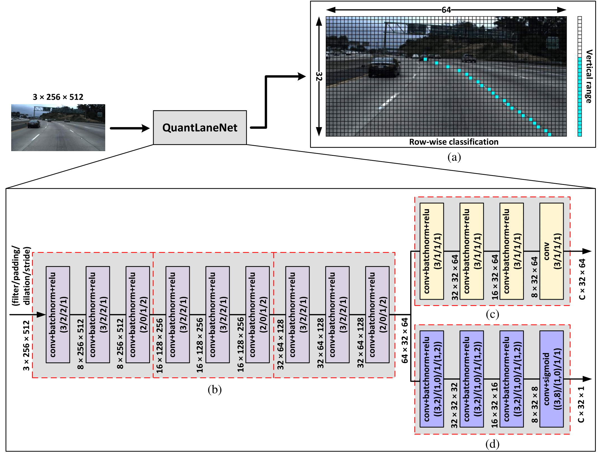

# QuantLaneNet: A 640-FPS and 34-GOPS/W FPGA-Based CNN Accelerator for Lane Detection
The official implementation of paper "[QuantLaneNet: A 640-FPS and 34-GOPS/W FPGA-Based CNN Accelerator for Lane Detection](https://www.mdpi.com/1424-8220/23/15/6661)".



## Dependency

### Operating system:
- Tested on Ubuntu 20.04.4 LTS

### Software:
- python (tested on Python 3.8.10)
- pytorch (tested on torch 1.11.0+cu113)
- cv2
- numpy
- matplotlib
- sklearn
- tqdm
- fixedpoint (https://pypi.org/project/fixedpoint/)
- csaps (https://pypi.org/project/csaps/)
- ptflops (https://pypi.org/project/ptflops/)
- timeout-decorator (https://pypi.org/project/timeout-decorator/)

### Hardware:
- Vivado v2020.2.2
- Virtex-7 VC707 FPGA

## Dataset
This source code is developed for the TuSimple dataset. The dataset can be downloaded from https://github.com/TuSimple/tusimple-benchmark/issues/3. After extracting, the dataset must be placed in this structure:

    dataset/        # Name of root dataset directory can be changed
    └── tusimple
        ├── test_set
        │   ├── clips                 # Test set images
        │   │   ├── 0530
        │   │   ├── 0531
        │   │   └── 0601
        │   └── test_label.json       # Labels for test set
        └── train_set
            ├── clips                 # Train set images
            │   ├── 0313-1
            │   ├── 0313-2
            │   ├── 0531
            │   └── 0601
            ├── label_data_0313.json  # Labels for train set
            ├── label_data_0531.json
            └── label_data_0601.json

## Train model
The trained weights are included in the repo under the [./checkpoint](./checkpoint) directory. If you want to train the model from scratch, this can be done by using the [train.py](./train.py) script. This script is written to be run with several arguments:
- <code>--device</code>: <code>cuda</code> or <code>cpu</code>, default as <code>cpu</code>.
- <code>--dataset_path</code>: path to root dataset directory mentioned above.
- <code>--checkpoint_path</code>: path to a directory that stores all the checkpoints generated during training. After training, this directory is used to get the trained weights of the model.
- <code>--loader_workers</code>: number of parallel workers to fetch dataset during training to increase speed, default as 1. As recommended by PyTorch, this number should be set to be 2 at most. However, everyone is free to experiment and find the best value for their system.
- <code>--epochs</code>: number of epochs to train. The results from the paper is achieved after running 150 epochs.
- <code>--batch_size</code>: set as 16 in the paper due to the constraint of GPU memory.

All codes are written to be run from the repo directory. To train the model, the [train.py](./train.py) script can be run using this example command (can be tweaked as needed):

    python3 ./train.py                    \
        --dataset_path      ./dataset     \
        --checkpoint_path   ./checkpoint  \
        --batch_size        16            \
        --epochs            150

After every epoch, 3 new files are automatically added to the checkpoint directory, with 'xxx' being the epoch number:
- checkpoint_xxx.pth
- eval_xxx.pth
- loss_xxx.pth

If training is interrupted for some reason, when rerun, the same directory should be passed to the <code>--checkpoint_path</code> argument, so that training can resume from the latest checkpoint rather than from the start. This is optimal for training on Google Colab since the time required to train the model usually exceeds the allowed runtime on the platform.

Once finished training, further scripts to test the model will require the same directory for their <code>--checkpoint_path</code> arguments to get the trained weights. The scripts will be able to find the epoch with the highest accuracy to load into the model, not the final epoch.

## Hardware implementation
[README_HW.md](./README_HW.md)

## Test model
To test the trained model, the [test.py](./test.py) script can be used. This script is written to run several tests on 3 different versions of the model. The type of model can be set by passing one of these values to the <code>--model</code> argument:
- <code>software</code>: the regular trained PyTorch model. If this model is chosen, two more arguments need to be set for it:
    - <code>--checkpoint_path</code>: path to the trained checkpoint directory.
    - <code>--device</code>: 'cpu' or 'cuda'.
- <code>quantized</code>: the 8-bit quantized model ([README_HW.md](./README_HW.md)).
- <code>fpga</code>: the hardware model implemented in FPGA ([README_HW.md](./README_HW.md)).

The test script has 4 modes, set with the <code>--test_mode</code> argument. Each mode comes with a different set of arguments:
- <code>image</code>: run the model on one single image. The path of the image needs to be passed to the <code>--image_path</code> argument.

        python3 ./test.py                     \
            --model             software      \
            --checkpoint_path   ./checkpoint  \
            --device            cuda          \
            --test_mode         image         \
            --image_path        <path to some image>

- <code>random_image</code>: run the model on a random image from the dataset. The path of the dataset directory needs to be passed to the <code>--dataset_path</code> argument.

        python3 ./test.py                     \
            --model             software      \
            --checkpoint_path   ./checkpoint  \
            --device            cuda          \
            --test_mode         random_image  \
            --dataset_path      ./dataset

- <code>video</code>: run the model on a video. The path of the video needs to be passed to the argument <code>--video_path</code>

        python3 ./test.py                     \
            --model             software      \
            --checkpoint_path   ./checkpoint  \
            --device            cuda          \
            --test_mode         video         \
            --video_path        <path to some video>

- <code>evaluate</code>: evaluate the model on the TuSimple dataset and output the Accuracy, FP and FN scores. The path of the dataset directory needs to be passed to the <code>--dataset_path</code> argument.

        python3 ./test.py                     \
            --model             software      \
            --checkpoint_path   ./checkpoint  \
            --device            cuda          \
            --test_mode         evaluate      \
            --dataset_path      ./dataset

Note that the images and video passed to the model should be cropped to similar composition to those in the TuSimple dataset to get the best accuracy.

## Offset map

As presented in the paper, the model has 2 output branches, 'classification' and 'vertical'. However, I include a third output in the code: 'offset map'. Even though this output barely increases the accuracy of the model, it does help smooth out the output visually. To use it, pass the argument <code>--use_offset</code> when run [test.py](./test.py) on the <code>software</code> or <code>quantized</code> version of the model.

    python3 ./test.py                     \
        --model             software      \
        --checkpoint_path   ./checkpoint  \
        --device            cuda          \
        --test_mode         random_image  \
        --dataset_path      ./dataset     \
        --use_offset

## Citation
```BibTeX
@Article{s23156661,
    author={Lam, Duc Khai and Du, Cam Vinh and Pham, Hoai Luan},
    title={QuantLaneNet: A 640-FPS and 34-GOPS/W FPGA-Based CNN Accelerator for Lane Detection},
    journal={Sensors},
    volume={23},
    year={2023},
    number={15},
    article-number={6661},
    url={https://www.mdpi.com/1424-8220/23/15/6661},
    issn={1424-8220},
    doi={10.3390/s23156661}
}
```