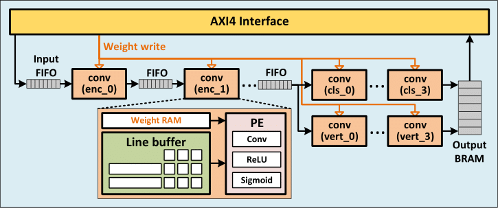
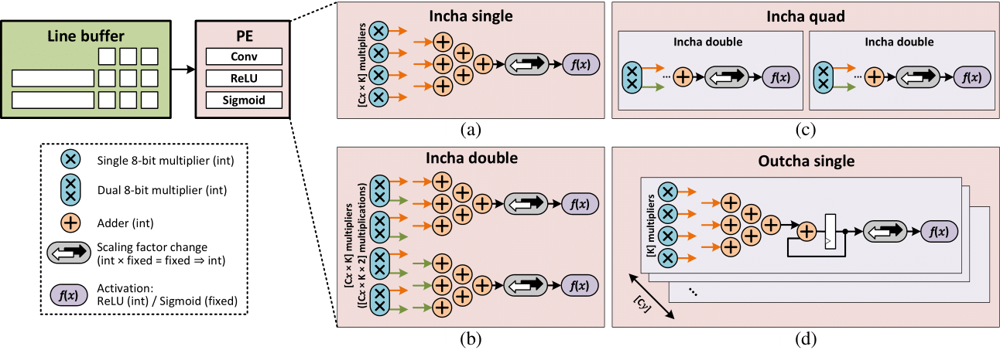

# Hardware implementation of QuantLaneNet on FPGA

## Hardware dependency

- Vivado v2020.2.2
- Virtex-7 VC707 FPGA

## Quantize model

To prepare the model for hardware implementation, data quantization is needed because the hardware design is wrtten to use quantized operations. The purpose of this step is to generate a file of quantized weights from the trained weights from the training step. This quantized weights file is later converted into a binary file for hardware implementation.

A quantized weights file is already included in the repo with the path [./weights/quantized_weights_pertensor_symmetric.pth](./weights/quantized_weights_pertensor_symmetric.pth). To re-quantize the model, run the [quantization_convert.py](quantization_convert.py) script with the following arguments:
- <code>--checkpoint_path</code>: path to the trained checkpoint directory.
- <code>--dataset_path</code>: path to dataset directory, used to calibrate the quantized model.
- <code>--quantized_weights_path</code>: path to the **OUTPUT** quantized weights file, with the extension .pth. By default the path is [./weights/quantized_weights_pertensor_symmetric.pth](./weights/quantized_weights_pertensor_symmetric.pth), which is already included in this repo.

Model quantization can be run using this example command:

    python3 ./quantization_convert.py                 \
        --dataset_path             ./dataset          \
        --checkpoint_path          ./checkpoint       \
        --quantized_weights_path   ./weights/quantized_weights_pertensor_symmetric.pth

## Preparations for hardware implementation

To prepare for running the FPGA, several files need to be generated. These include:
- RTL code for the CNN model (verilog).
- Binary weights file, generated from the quantized weights file.
- Constraints for Vivado if ILA debug core is wanted (.xdc)

All of these files are already included in the repo, but if they need to be re-generated for some reason, modification or otherwise, this can be done by using the '*_gen.py' scripts.
- To generate RTL code for the model, run the [fpga_model_rtl_gen.py](fpga_model_rtl_gen.py) script. The RTLs for the component modules are already defined the [./vivado_sources/rtl](./vivado_sources/rtl), with the [model.v](./vivado_sources/rtl/model.v) file calling multiple 'conv' instances with different parameter configurations based on the quantized model. Should the quantized model be modified somehow and a new 'model.v' need to be generated accordingly, the './fpga_model_rtl_gen.py' script can be run. This will overwrite the old file. To write to a different file, a path can be passed to the <code>--rtl_path</code> argument.

        python3 ./fpga_model_rtl_gen.py

- To generate binary weights file for the FPGA, the quantized weights file must first exist ([quantization_convert.py](./quantization_convert.py)). The [fpga_weights_gen.py](fpga_weights_gen.py) script can be run with the following arguments:
    - <code>--weights_bin_path</code>: path to the output binary weights file. By default the path is [./weights/fpga_weights.bin](./weights/fpga_weights.bin), which is already included in this repo.
    - <code>--quantized_weights_path</code>: path to the quantized weights file generated by the above step.

    For example:

        python3 ./fpga_weights_gen.py                                   \
            --weights_bin_path         ./weights/fpga_weights.bin       \
            --quantized_weights_path   ./weights/quantized_weights_pertensor_symmetric.pth

- Optionally, hardware can be synthesized with an Integrated Logic Analyzer (ILA) core that samples signals during runtime and send to Vivado to render waveform for debugging or just to observe the operations of the circuit underneath. To include this ILA core without using GUI (since the synthesized design is quite large and hard to navigate in GUI), a constraint file (.xdc) needs to be included before running Synthesis. This file is included in the repo at the path [./vivado_sources/constraints/debug.xdc](./vivado_sources/constraints/debug.xdc) that mark all the signals that I think is important. If you want to modify the list of signals included, they can be modified in the [fpga_debug_constrs_gen.py](fpga_debug_constrs_gen.py) script by changing the <code>debug_ports</code> list.

    However, selecting a random net from the RTL design is not guaranteed to work as the synthesized netlist can be modified when Vivado tries to optimize the design. Selecting nets for debugging will require some experimentation to figure out. The ones I have included are tested in Vivado v2020.2.2.

    The script can be run without any arguments, and will overwrite the old .xdc file. To write to a different file, a path can be passed to the <code>--debug_path</code> argument

        python3 ./fpga_debug_constrs_gen.py

## Build Vivado project and run implementation

Once all the necessary files are generated, a Vivado project can be built. To automate this process, I have included several Tcl scripts in the directory [vivado_scripts](./vivado_scripts). These scripts are tested on Vivado v2020.2.2. For other Vivado versions, if there are errors while running these scripts, experimentations on the GUI may be needed to modify them to be compatible.

To build the project, run the [vivado_scripts/build_project.tcl](./vivado_scripts/build_project.tcl) script using Vivado in the terminal. This script is written to be used with several arguments that can be passed to the <code>-tclargs</code> option of Vivado.

- <code>gui</code>: build the project in GUI mode. By default the project will be built in terminal.
- <code>launch_run</code>: automatically launch Synthesis and Implementation after building project.
- <code>debug</code>: add ILA debug core to the design. By default the project does not include the constraints for ILA core.
- <code>\<project directory path></code>: the path to the directory of the project. If not given, the default path will be './vivado_project'.

These arguments can be passed in any order. For example, to build a project in the the directory './quantlanenet_vivado' with debug core included, run this command:

    vivado -mode tcl -source ./vivado_scripts/build_project.tcl \
        -tclargs ./quantlanenet_vivado debug

To build a project in the default path of './vivado_project' in GUI mode, run this command:

    vivado -mode tcl -source ./vivado_scripts/build_project.tcl \
        -tclargs gui

To build a project in the terminal, with debug core included and automatically launch implementation, in a directory named './quantlanenet_vivado_debug', run this command:

    vivado -mode tcl -source ./vivado_scripts/build_project.tcl \
        -tclargs debug launch_run ./quantlanenet_vivado_debug

Running the script with no input arguments will build the project in the path './vivado_project' in the terminal, with no debug core and will exit Vivado right after finishing building the project, requiring the project to be re-opened manually to run implementation.

    vivado -mode tcl -source ./vivado_scripts/build_project.tcl

## Program FPGA

After finished running implementation, a bitstream file should be generated in the path '\<project directory>/QuantLaneNet.runs/impl_1/design_1_wrapper.bit'. This file is used to program the FPGA. This can either be done in the GUI using 'Hardware Manager', or by running the [vivado_scripts/program_fpga.tcl](./vivado_scripts/program_fpga.tcl) script. This script is written to be used with 2 arguments:

- <code>\<bitstream path></code>: the path to the bitstream file. If not given, the default path is './vivado_project/QuantLaneNet.runs/impl_1/design_1_wrapper.bit'.
- <code>write_flash</code>: by default, this script only program the FPGA with the design. But the design will not stay once power is cut from the FPGA. To permanently write the design to the flash memory on the FPGA kit, this option can be used.

For example, programming './quantlanenet_vivado_debug/design_1_wrapper.bit' to FPGA, as well as writing to flash memory:

    vivado -mode tcl -source ./vivado_scripts/program_fpga.tcl \
        -tclargs ./quantlanenet_vivado_debug/design_1_wrapper.bit write_flash

Programming bitstream from default path of './vivado_project/QuantLaneNet.runs/impl_1/design_1_wrapper.bit' to FPGA, without writing to flash:

    vivado -mode tcl -source ./vivado_scripts/program_fpga.tcl

After programming, make sure to restart the PC so that the PCIe device can be properly recognized.

## Install drivers for XDMA

After programming the FPGA and restarting the PC, drivers are needed for communication between the CPU (x86) and the XDMA core inside the FPGA. These drivers are provided by Xilinx at https://github.com/Xilinx/dma_ip_drivers. Clone the repo and go to its directory.

    git clone https://github.com/Xilinx/dma_ip_drivers.git
    cd ./dma_ip_drivers

Some packages need to be installed before the XDMA drivers can be compiled:

    sudo apt install -y gcc make dwarves

After cloning, go to the repo directory and cd to 'XDMA/linux-kernel/' and follow the directions in 'readme.txt', specifically:

    cd ./xdma
    sudo make install        # Install drivers
    cd ../tests
    sudo ./load_driver.sh    # Load drivers

If no errors occur, these char devices should appear when run <code>ls -l /dev/\*xdma*</code>:

    # ls -l /dev/*xdma*
    crw------- 1 root root 234, 36 Aug  7 10:32 /dev/xdma0_c2h_0
    crw------- 1 root root 234,  1 Aug  7 10:32 /dev/xdma0_control
    crw------- 1 root root 234, 10 Aug  7 10:32 /dev/xdma0_events_0
    crw------- 1 root root 234, 11 Aug  7 10:32 /dev/xdma0_events_1
    crw------- 1 root root 234, 20 Aug  7 10:32 /dev/xdma0_events_10
    crw------- 1 root root 234, 21 Aug  7 10:32 /dev/xdma0_events_11
    crw------- 1 root root 234, 22 Aug  7 10:32 /dev/xdma0_events_12
    crw------- 1 root root 234, 23 Aug  7 10:32 /dev/xdma0_events_13
    crw------- 1 root root 234, 24 Aug  7 10:32 /dev/xdma0_events_14
    crw------- 1 root root 234, 25 Aug  7 10:32 /dev/xdma0_events_15
    crw------- 1 root root 234, 12 Aug  7 10:32 /dev/xdma0_events_2
    crw------- 1 root root 234, 13 Aug  7 10:32 /dev/xdma0_events_3
    crw------- 1 root root 234, 14 Aug  7 10:32 /dev/xdma0_events_4
    crw------- 1 root root 234, 15 Aug  7 10:32 /dev/xdma0_events_5
    crw------- 1 root root 234, 16 Aug  7 10:32 /dev/xdma0_events_6
    crw------- 1 root root 234, 17 Aug  7 10:32 /dev/xdma0_events_7
    crw------- 1 root root 234, 18 Aug  7 10:32 /dev/xdma0_events_8
    crw------- 1 root root 234, 19 Aug  7 10:32 /dev/xdma0_events_9
    crw------- 1 root root 234, 32 Aug  7 10:32 /dev/xdma0_h2c_0

On my Ubuntu machine (20.04.4 LTS), when run <code>make install</code> from the xdma directory, some errors happened because of the lack of a signing key as well as some system files being placed in different locations from what the xdma repo expects. On my machine, this can be fixed by running the [xdma_scripts/xdma_fix.sh](./xdma_scripts/xdma_fix.sh) script, included in this repo:

    sudo ./xdma_scripts/xdma_fix.sh

The reloading of the XDMA drivers can also be done quickly by running my [xdma_scripts/xdma_reload.sh](./xdma_scripts/xdma_reload.sh) script in the xdma drivers directory:

    sudo ./xdma_scripts/xdma_reload.sh

## Test model

After programming the FPGA and installing the XDMA drivers, the hardware model can be used by running [test.py](./test.py) or the './test_fpga_*.py' scripts.

The [test.py](./test.py) script is written to run several tests on 3 different versions of the model. The type of model can be set by passing one of these values to the <code>--model</code> argument:
- <code>software</code>: the regular trained PyTorch model ([README.md](./README.md)).
- <code>quantized</code>: the 8-bit quantized model. This model comes with an argument for the quantized weights file path:
    - <code>--quantized_weights_path</code>: path to quantized weights file.
- <code>fpga</code>: the hardware model implemented in FPGA. This model comes with an argument for the binary weights file path:
    - <code>--weights_bin_path</code>: path to binary weights file, converted from quantized weights.

Just like the regular software version, this script offers 4 different test modes: <code>image</code>, <code>random_image</code>, <code>video</code> and <code>evaluate</code>. However, since the fpga model requires using char devices, root privileges are needed. For example:

    sudo python3 ./test.py                               \
        --model              fpga                        \
        --weights_bin_path   ./weights/fpga_weights.bin  \
        --test_mode          random_image                \
        --dataset_path       ./dataset

Or:

    python3 ./test.py                                                                   \
        --model                    quantized                                            \
        --quantized_weights_path   ./weights/quantized_weights_pertensor_symmetric.pth  \
        --test_mode                video                                                \
        --video_path               <path to some video>

In the main [test.py](./test.py) script, the FPGA model is wrapped in a class to be compatible with the test functions. However, this introduces some delay, which would produce slower speed than the highest possible. The [test_fpga_speed.py](./test_fpga_speed.py) script is written to purely test the speed of the FPGA with minimal delay by the Python language. This script can be run without any input arguments:

    sudo python3 ./test_fpga_speed.py

In the same way, the [test_fpga_video.py](./test_fpga_video.py) is written to run videos with minimal delay by the Python language. This script can be run with an input argument <code>--video_path</code> for the path of the video:

    sudo python3 ./test_fpga_video.py --video_path <path to some video>
